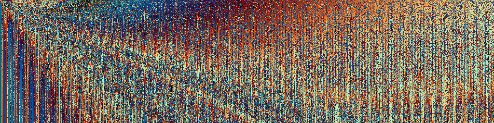

This is a simple program to procedurally generate a random function and use it to create a hopefully interesting image. The original idea was to use genetic programming techniques on these expression trees to search for better and better images, but that hasn't happened yet.

### BUILDING

On Ubuntu 18.04 LTS:

1. `sudo apt-get install git make gcc lua5.1 liblua5.1-dev`
2. `git submodule init && git submodule update`
3. build `lib/lua-gd` (see https://github.com/ittner/lua-gd/issues/9 for help)

To run, type `make run` for a demo or `lua5.1 robo.lua` for a random seed and check `images/`.

### LICENSE
This project is released into the public domain with the help of CC0.
See `COPYING` for more information.
